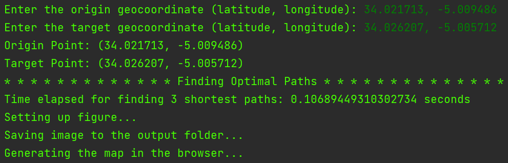
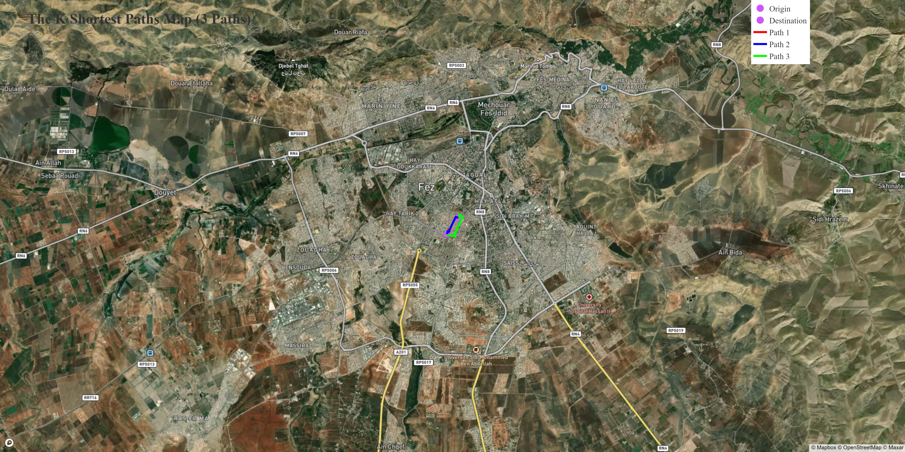

# K Find Shortest Route in Map

## Project Summary:

This project implements a K Shortest Paths Finder using graph theory principles.
The primary goal is to find the top K shortest paths between
two given geocoordinates on a road network.
The application utilizes the NetworkX library for graph manipulation,
OSMnx for road network extraction, and Plotly for interactive map visualization.

## Usage:

### Input Geographic Coordinates:

Users are prompted to enter the origin and destination coordinates in the format (latitude, longitude).

### Paths Generation:

1. The script uses OSMnx to build a graph of the road network within a specified perimeter around the entry points.
2. A custom algorithm is applied to find the K shortest paths between the origin and destination nodes.

### Visualization:

1. The Plotly library is used to create an interactive map.
2. The origin and destination points are highlighted, along with the K shortest paths, each having a distinct color.

### Output:

1. A static image of the map is generated in the 'output' folder.
2. An interactive map is opened in the default web browser.

## Dependencies:

- Python 3.x
- NetworkX
- Plotly
- OSMnx
- NumPy

## Instructions:

1. Clone the repository: `git clone <repository_URL>`
2. Run the script: `python k_shortest_paths_mapper.py`
3. Follow on-screen instructions to input origin and destination coordinates.
4. View the generated map in the 'output' folder and in the web browser.

## Code Explanation:

### `k_shortest_paths(graph, start_node, end_node, k)`

**Input:**
- `graph`: The road network graph.
- `start_node`: The origin node in the graph.
- `end_node`: The destination node in the graph.
- `k`: The number of shortest paths to find.

**Output:**
Returns a list of the K shortest paths between the origin and destination nodes.

### `generate_paths(origin_point, target_point, perimeter, k)`

**Input:**
- `origin_point`: A tuple of (latitude, longitude) for the origin.
- `target_point`: A tuple of (latitude, longitude) for the destination.
- `perimeter`: A perimeter around the entry points to create the road network graph.
- `k`: The number of shortest paths to find.

**Output:**
Returns a list of paths, each represented by a tuple of (list of longitudes, list of latitudes, path index).

### `plot_map(origin_point, target_point, paths, k)`

**Input:**
- `origin_point`: A tuple of (latitude, longitude) for the origin.
- `target_point`: A tuple of (latitude, longitude) for the destination.
- `paths`: A list of paths to visualize.
- `k`: The number of shortest paths to visualize.

**Output:**
Generates an interactive map using Plotly.
Saves a static image of the map in the 'output' folder.

## Note
The script uses the Mapbox API for map rendering. Please note that the Mapbox API is not free, and you will need to replace the placeholder 'mapbox_accesstoken' with your valid Mapbox API key.

To replace the placeholder:
1. Obtain a Mapbox API key by signing up on the [Mapbox website](https://www.mapbox.com/).
2. Replace 'mapbox_accesstoken' with your obtained API key in the script (`k_shortest_paths_finder.py`), specifically in the line that sets up the interactive map using Plotly.

Example:
```python
# Replace 'mapbox_accesstoken' with your Mapbox API key
fig = go.Figure(go.Scattermapbox(
    ...
    mapbox=dict(accesstoken='YOUR_MAPBOX_API_KEY'),
    ...
))
```

### User Input Validation:

Ensures that the user enters valid latitude and longitude values.

### Constants:

- `perimeter`: A constant value representing the perimeter around entry points for creating the road network graph.
- `k`: A constant value representing the number of shortest paths to find and visualize.

### Output




